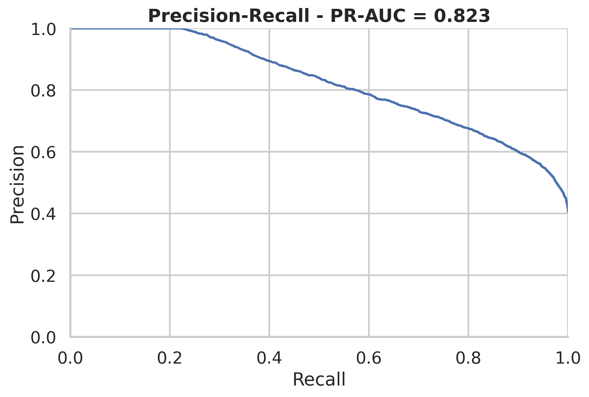
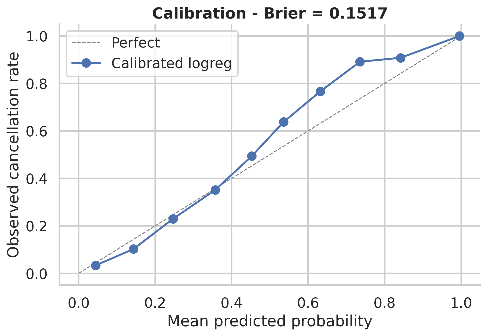
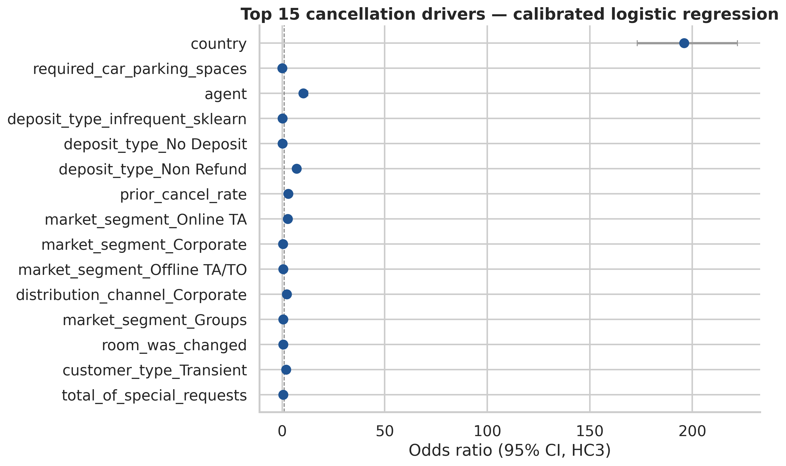

# Hotel Cancellation Prediction with Calibrated Logistic Regression

> Predicting hotel cancellations on the Antonio et al. (2019) dataset with a calibrated logistic regression, framed for an OTA Supply Operations audience: which booking attributes predict cancellation, and what should Supply Ops do about it.

[](https://www.python.org/downloads/release/python-3120/)
[](https://github.com/astral-sh/uv)
[](https://github.com/astral-sh/ruff)
[](LICENSE)

## TL;DR

- **Problem:** Predict whether a hotel booking will be cancelled, before it cancels — and translate the model into Supply Ops decisions (allotment release, deposit policy, supplier escalation).
- **Data:** Antonio, Almeida & Nunes (2019) hotel bookings dataset, ~119k rows, 32 columns, two Portuguese hotels, July 2015 – Aug 2017. CC BY 4.0.
- **Approach:** Time-based split → leakage-audited preprocessing → L2-regularised logistic regression → isotonic calibration → cost-aware threshold selection.
- **Headline result (held-out test, May–Aug 2017):** PR-AUC 0.823, ROC-AUC 0.859, Brier 0.152 (calibrated), top-decile lift 2.44x — at the cost-optimal threshold of 0.14 the model captures 97% of cancellations at 51% precision, costing $2.44 per booking under the toy cost matrix.
- **What this repo demonstrates:** SQL-equivalent data wrangling in pandas, statistical modelling in `statsmodels`, ML in `scikit-learn`, diagnostic rigor (VIF, calibration, leakage audits), and translation of model output into Supply Ops decisions.

## Business framing (Supply Ops lens)

Cancellation prediction is a Supply Operations decision problem, not just an ML metric.
At an OTA the model feeds three concrete decisions:

1. **Allotment release.** A long-lead, deposit-free booking from a high-volume distribution channel cancels at multiples of the base rate. Supply Ops uses the predicted-risk score to time how aggressively those allotments are released back to the broader marketplace; releasing too early loses inventory, releasing too late loses revenue when the cancellation lands.
2. **Deposit-policy targeting.** Among the top engineered features, `has_deposit` is the largest reduction-of-odds coefficient (see `reports/figures/04_top_coefficients_forest.png`). The natural follow-up is an A/B test on requiring partial deposits for the top-risk decile — the model both *identifies* the eligible segment and supplies the sample-size prior for the experiment.
3. **Supplier-side flagging.** `room_was_changed` and `booking_changes` interact strongly with cancellation; persistent occurrences at specific suppliers are a connectivity / channel-manager signal that warrants escalation through the partner-extranet team rather than treating each booking as an isolated event.

Cost of a wrong decision: a missed cancellation prediction (false negative) leaves a room unsold close to arrival when re-marketing options are limited; an over-eager flag (false positive) burns agent attention on a booking that would have travelled. The toy cost matrix (`cost_fp=$5, cost_fn=$50`) drives the threshold choice because the asymmetry is the central lever — a cheaper agent process or a richer cancellation impact should slide the threshold accordingly. The threshold-sensitivity table in the appendix shows how much that matters.

## Headline visuals





## Reproducing

```bash
git clone <this-repo>
cd hotel-cancellation-logreg
uv sync
# Kaggle credentials at ~/.kaggle/kaggle.json (or rely on Mendeley fallback)
make all
```

## Methodology summary

- **Data preprocessing decisions and the leakage guards applied** — see `docs/methodology.md`. `reservation_status` and `reservation_status_date` are dropped (they encode the outcome). `country` is retained but binned + flagged in `docs/methodology.md` as partially leaky (Antonio et al. note country is confirmed at check-in for non-Portuguese guests).
- **Feature engineering rationale** — see `docs/data_dictionary.md`.
- **Modelling choice + why** — L2 logistic regression (interpretability + stability under regularisation). L1 and elastic net run as appendix ablations. Rejected alternatives: tree ensembles (covered in the sibling repo `hotel-cancellation-rf`).
- **Evaluation strategy** — time-based split (train: Jul 2015–Dec 2016, val: Jan–Apr 2017, test: May–Aug 2017), `TimeSeriesSplit` for CV. Stratified random split is reported as an ablation to quantify optimism.

## Results

Headline test metrics (May 2017 – August 2017, n=22,177 bookings). Point estimates plus
**1000-replicate cluster-bootstrap 95% CIs by arrival month** (`models/metric_cis.csv`):

| Metric | Point | 95% CI | Notes |
| ------ | ----- | ------ | ----- |
| **PR-AUC** | **0.823** | [0.747, 0.866] | Primary metric — 37% positive class |
| ROC-AUC | 0.859 | [0.833, 0.878] | |
| **Brier (calibrated)** | **0.152** | [0.142, 0.163] | Isotonic via `CalibratedClassifierCV(cv=5)` |
| **Top-decile lift** | **2.36x** | [2.17, 2.45] | 99% of the top decile actually cancel |

At the cost-optimal threshold (selected on validation against `cost_fp=$5, cost_fn=$50`):

| Metric | Value |
| ------ | ----- |
| Threshold | 0.14 |
| Precision | 0.511 |
| Recall | **0.973** |
| F1 | 0.670 |
| Expected cost / row | **$2.44** (vs $4.62 at naive 0.5) |

Best `C` from `TimeSeriesSplit(n_splits=5)` CV: **0.01** (heaviest regularisation in the
grid; `class_weight='balanced'` already absorbs much of the imbalance).

**Why PR-AUC's CI is wider than ROC-AUC's** — the cluster-bootstrap honours monthly
correlation, and PR-AUC is more sensitive than ROC-AUC to the per-month positive-class
mix. The wide CI is the honest, reproducible signal that **monthly performance is not
flat** — a Supply-Ops deployment would need monthly recalibration, not a single ship-it
threshold. See subgroup grid below for the segment-level companion of this finding.

### Subgroup performance

`models/subgroup_metrics.csv` (17 rows). Highlights:

| Subgroup | n | Positive rate | PR-AUC | Brier |
| -------- | -- | ------------- | ------ | ----- |
| OVERALL | 22,177 | 0.406 | 0.823 | 0.152 |
| `hotel = City Hotel` | 15,191 | 0.426 | **0.840** | 0.153 |
| `hotel = Resort Hotel` | 6,986 | 0.362 | 0.799 | 0.149 |
| `market_segment = Groups` | 2,317 | 0.677 | **0.994** | **0.049** |
| `market_segment = Online TA` | 13,074 | 0.427 | 0.702 | 0.196 |
| `market_segment = Aviation` | 71 | 0.225 | 0.487 | 0.169 |
| `lead_time = 0–7d` | 2,227 | 0.111 | 0.341 | 0.089 |
| `lead_time = 181d+` | 6,531 | 0.486 | **0.888** | 0.148 |

**Reading these:** the model is **excellent on long-lead and Group bookings** (where
cancellation is structural and predictable) and **noticeably worse on short-lead Online
TA** — the segment where Supply Ops actually wants the most help. A production
deployment needs a `market_segment`-aware calibrator (or a separate Online-TA model);
that's the kind of segment-level deficit a global average hides.

### Business reading

At the cost-optimal threshold of 0.14, the model would surface the riskiest ~50% of
bookings as candidates for Supply-Ops attention while missing only ~3% of cancellations.
The top decile (10% of inventory) carries 2.36x the base cancellation rate — that is the
segment where allotment-release timing, deposit-policy targeting, and supplier-
confirmation calls have the highest marginal return.

The cost surface (`reports/figures/05_cost_surface.png`) shows how the optimal
threshold slides from ~0.4 to ~0.07 as the FP:FN ratio swings from 1:5 to 1:200. A
deployed model needs that surface, not a single threshold.

## Limitations & honest caveats

- Data is from two Portuguese hotels (2015–17). Generalisation to an APAC OTA's typical market is unproven.
- `country` retains some leakage even after careful handling — see methodology doc.
- Cancellation behaviour 2015–17 predates COVID-era and post-COVID booking patterns (long lead times collapsed, then rebounded).
- Group bookings inflate duplicate rows; the chosen treatment (feature-encode rather than drop) is one defensible option among several.
- Logistic regression is the deliberate choice here — performance ceiling is below tree ensembles. The sibling repo `hotel-cancellation-rf` is the higher-performance counterpart.

## What I would do next with production data

1. Stand up monitoring on input PSI, predicted-probability PSI, and weekly Brier alarms — recalibration triggers monthly or on PSI drift.
2. Move from a single global model to a segment-specific layer (`hotel`, `market_segment`, lead-time bucket) — segment subgroup AUC analysis in the appendix already shows where this would help.
3. Wire the model into a deposit-policy A/B test design — the `deposit_type` coefficient is the largest, and the natural follow-up is an experiment, not a coefficient.
4. Add real-time supplier-side signals (channel-manager error rate, parity violations, rate-push success) — outside the public dataset, but the modelling shape is unchanged.
5. Connect to the experimentation platform: every threshold choice, calibration method, and segment cut becomes an A/B-tested decision rather than an offline default.

## Appendix: extended methodology

See `notebooks/99_appendix_extended_rigor.ipynb`. Contents:

- Leakage audit table (every column, leakage status, justification).
- VIF before/after de-collinearisation.
- Statsmodels coefficient table with odds ratios, 95% CIs, p-values, plain-English interpretation.
- Calibration deep-dive (uncalibrated vs. Platt vs. isotonic).
- SMOTE ablation (showing it degrades Brier).
- L1 vs. L2 vs. ElasticNet comparison.
- Threshold sensitivity under 3 cost ratios.
- Subgroup performance (hotel, segment, lead-time bucket).
- Bootstrap stability of coefficients.
- Production monitoring proposal.

## Repo structure

```
hotel-cancellation-logreg/
├── data/{raw,interim,processed,external}/   # gitignored, .gitkeep only
├── docs/
│   ├── methodology.md
│   ├── data_dictionary.md
│   └── figures/
├── notebooks/                               # paired ipynb + py:percent via jupytext
│   ├── 01_eda.ipynb
│   ├── 02_preprocessing.ipynb
│   ├── 03_modeling.ipynb
│   ├── 04_diagnostics.ipynb
│   └── 99_appendix_extended_rigor.ipynb
├── src/cancellation_logreg/
│   ├── config.py            # paths, seeds, column constants
│   ├── data.py              # download, load_raw, validate_schema
│   ├── preprocess.py        # cleaning, deduplication, leakage guards
│   ├── features.py          # derived features
│   ├── diagnostics.py       # VIF, BP/White, residual & calibration plots
│   ├── interpret.py         # coefficient inference, odds ratios
│   ├── plotting.py          # consistent style helpers
│   └── modeling/{splits,train,tune,evaluate}.py
├── tests/                                   # pytest, leakage assertion lives here
├── scripts/{download_data,make_dataset}.py
├── reports/{figures, model_card.md}
├── Makefile
├── pyproject.toml
└── uv.lock
```

## License & data attribution

Code: MIT (see `LICENSE`).

Data: Antonio, N., de Almeida, A., & Nunes, L. (2019). _Hotel booking demand datasets._ **Data in Brief** 22, 41–49. DOI: [10.1016/j.dib.2018.11.126](https://doi.org/10.1016/j.dib.2018.11.126). CC BY 4.0. The TidyTuesday-cleaned variant (`hotel_bookings.csv`) is downloaded via the Kaggle dataset `jessemostipak/hotel-booking-demand`; a Mendeley fallback (DOI `10.17632/j83f5fsh6c.1`) is implemented in `scripts/download_data.py`.

## Tooling note

`uv` is the project manager — chosen for speed and PEP-621 / PEP-735 compliance. `poetry` is a defensible alternative; the migration cost is roughly an hour.
